前端代码仓库: [https://gitee.com/ytiona/kan_bar_applets](https://gitee.com/ytiona/kan_bar_applets)

### apidoc，运行：npm run apidoc 即可在根目录下生成api文档
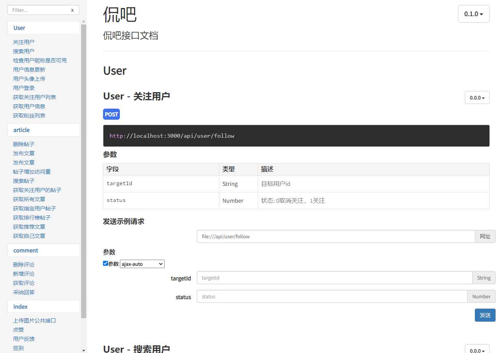

### 所有的表
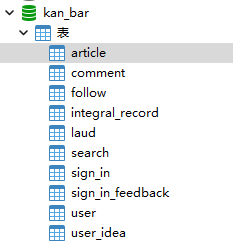

### 文章表
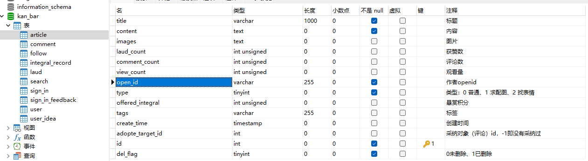

### 评论表
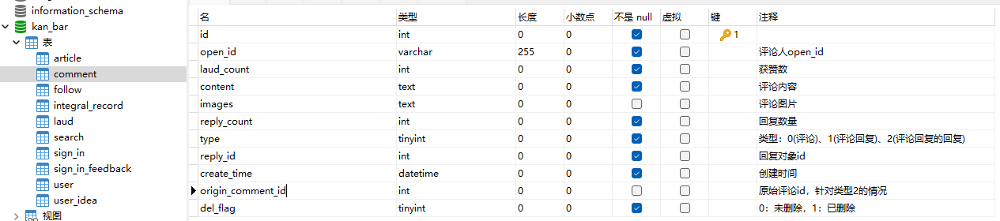

### 关注表
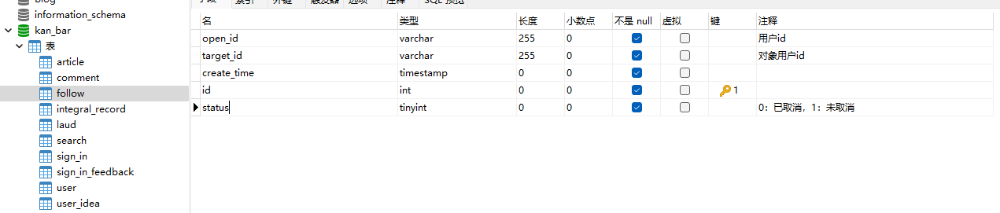

### 积分记录表
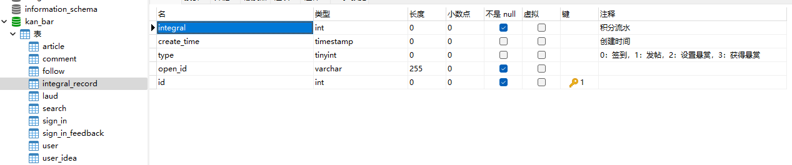

### 点赞记录表
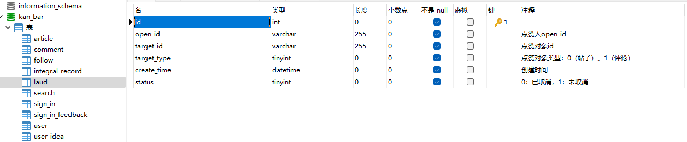

### 关键词搜索次数表
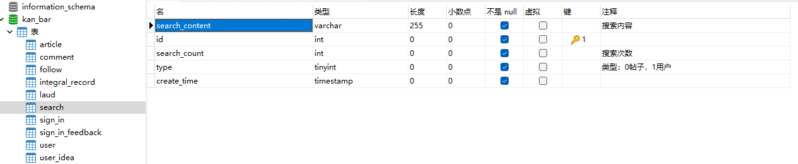

### 签到记录表
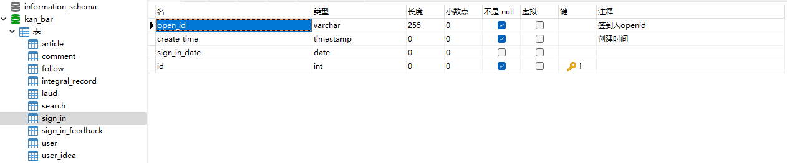

### 签到反馈配置表
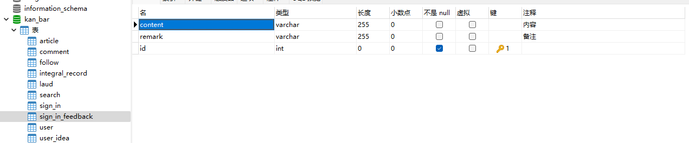

### 用户表
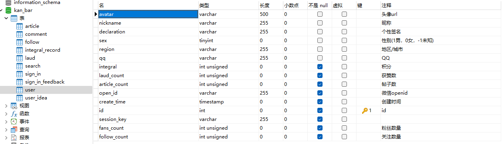

### 用户建议记录表
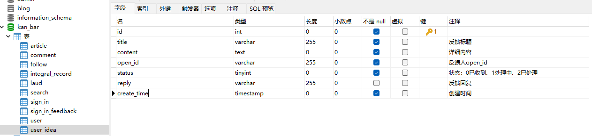
